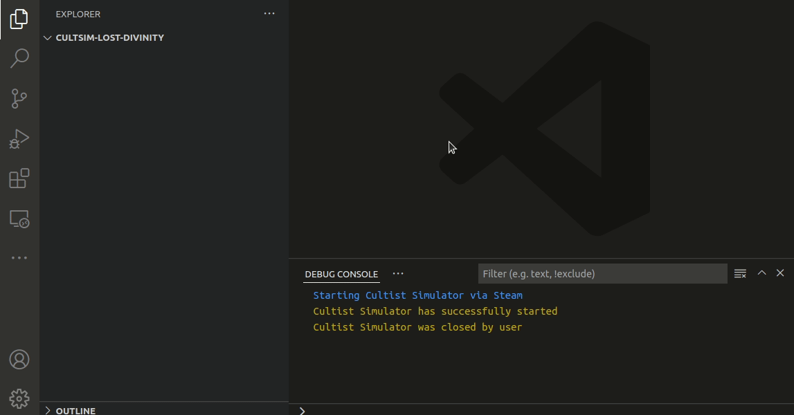
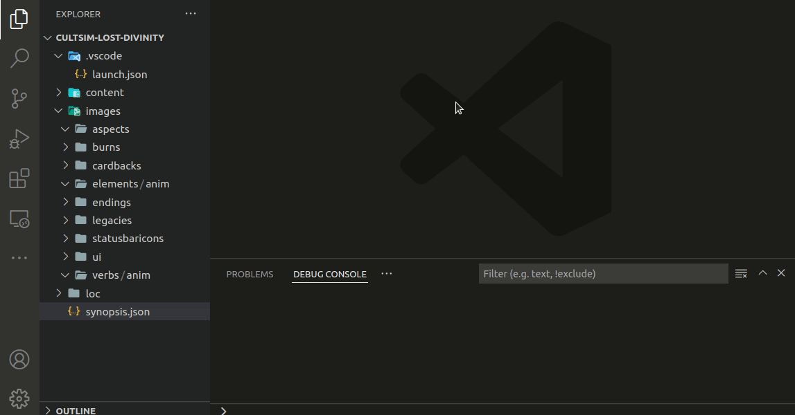

# Cultist Simulator VSCode Extension

Simplifies Cultist Simulator modding by providing an interactive editor with panels, also comes with a primitive debugger.

## Features

### Interactive Editor for Content files
Open your mod content with an interactive editor instead of typing everything in pure JSON

### Easy Project Setup

`F1` > `Cultist Simulator: New Project`

Enter some mandatory info and then you are ready to go

### Debugger
Extension supports a primitive debugger that can at the moment start, stop and restart the game, it also supports some error checking.

## Requirements

* Linux / Windows
* Cultist Simulator (Steam Edition) (For debugger and core content [*can be disabled*])

## Extension Settings

This extension contributes the following settings:

* `cultsim.streamingAssetsPath`: path to streaming assets ***(see FAQ)***
* `cultsim.disableCoreContent`: enable/disable usage of core game content (speeds up extension activation)
* `cultsim.disableInteractiveUI`: enable/disable interactive UI

## Roadmap

* [x] Editor
* [x] Debugger
* [x] Commands
  * [x] New Project
  * [x] Show Documentation
  * [x] Show Reference
  * [x] Show Log
* [ ] Content
  * [x] Support for `Synopsis`
  * [x] Support for `Verb`
  * [x] Support for `Legacy`
  * [x] Support for `Ending`
  * [x] Support for `Element`
  * [ ] Support for `Deck`
  * [ ] Support for `Recipe`
* [ ] Solving Known Issues
* [ ] Add requested improvements
* [ ] Add requested features

## Contributors
Not all contributors know that they are, but we know and therefor they shall have our praise.

This VSCode Extension would not see the light of day if it wasn't for the awesome people of the developer and modding
community providing excellent documentation, tips and tricks and in general keeping the Cultist Simulator
engine alive with new awesome content. and also thanks to the VSCode community for providing good examples to follow.

Feel free to visit my Ko-Fi page if you think that this extension is awesome :)

Feel free to visit the [Issues]([da](https://github.com/Tiinusen/vscode-cultsim/issues)) pages if it sucks, your experience is very important to me.

## FAQ

### Where do I find the streaming assets path?

It's located at "`steamapps/common/Cultist Simulator/CS_Data/StreamingAssets`" which differs depending on OS.
Can easily be located by launching **Steam** and **right-click** on **Cultist Simulator** then go to
**Local Files** and **left-click** on **Browse**.

## Known Issues

These known issues are planned to be solved once extension has reached MVP

### ID selection lagg
There is a known delay when picking an ID on windows, this is mostly due to content merging between
core content and workspace content, if this becomes to annoying and if you are in no need of the core content
just disabled it via settings.

### Suggestions box far left than it's suppose to
I don't know why it occurs, I have tried solving it without luck, thinks it's due to Leaflet will look into it at the end of the MVP.

### Opening large files
It's know that if you open large core content files it will render some items out of the board view.
A improved layouter is on the way